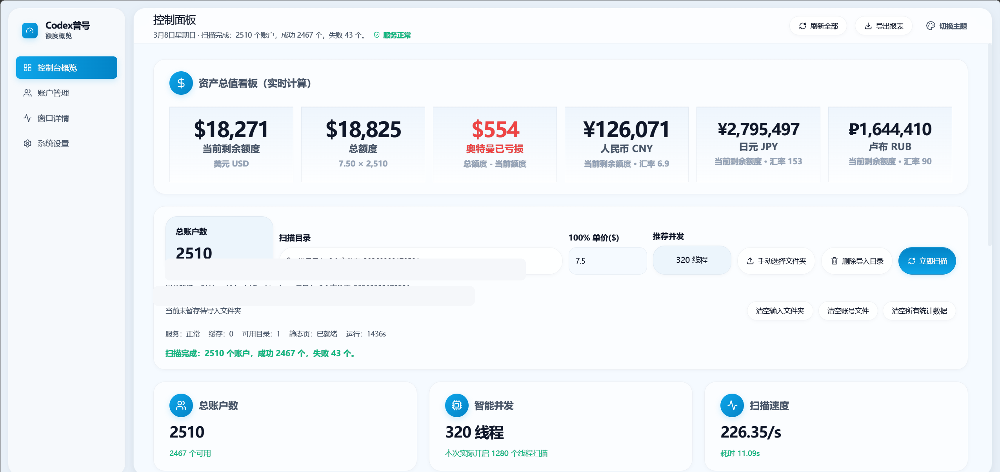
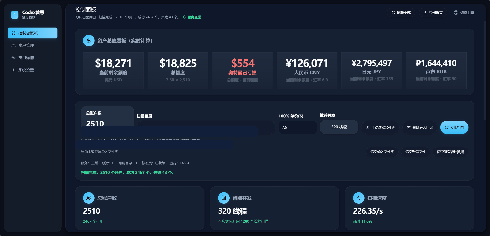

# Codex 普号额度概览

[English](./README_EN.md)

一个面向 Windows 的本地额度扫描面板，用来批量导入认证 `JSON` 文件、实时查询 Codex 额度，并以可视化方式展示总额度、当前剩余额度、亏损额度、账户列表和窗口详情。

## 项目亮点

- 支持在浏览器中手动选择文件夹导入认证文件
- 支持连续多次选择文件夹，再一次性导入和扫描
- 递归扫描大量 `JSON` 文件
- 基于 CPU 线程数自动计算推荐并发
- 服务端分页加载大结果，适合大规模号池
- 结果落盘，刷新页面不自动重扫
- 支持导出 CSV、清空统计、清空导入目录

## 演示图片

> 以下截图已做脱敏处理，截图中的额度与汇率数字仅用于界面演示，实际运行结果以程序当前计算结果为准。

### 1. 亮色主题总览



### 2. 深色主题总览



## 系统要求

- Windows 10 / Windows 11
- Go 1.25+
- Node.js 18+
- npm

> 如果你只是普通用户，不想安装开发环境，建议下载 GitHub Releases 里的运行版压缩包，而不是源码。

## 快速开始

### 方式一：双击脚本

1. 双击 `一键安装环境.bat`
2. 双击 `一键启动服务.bat`
3. 浏览器打开 `http://127.0.0.1:8787`
4. 在页面中手动选择文件夹并点击“立即扫描”

### 方式二：开发模式

后端：

```powershell
cd backend
go run .\cmd\server -open-browser=false
```

前端：

```powershell
cd web
npm install
npm run dev
```

## 目录结构

```text
.
├─ backend/                  Go 后端
│  ├─ cmd/server/            服务入口
│  └─ internal/app/          路由、扫描、分页、落盘等核心逻辑
├─ web/                      React + Vite 前端
│  ├─ src/                   页面和组件源码
│  └─ public/                静态资源
├─ docs/images/              README 演示图片
├─ 一键安装环境.bat
├─ 一键启动服务.bat
├─ 一键停止服务.bat
├─ 操作说明.txt
└─ AI接手指南.md
```

## 关键接口

- `GET /api/health`
- `GET /api/meta`
- `POST /api/import-folder`
- `POST /api/scan-job`
- `POST /api/refresh-job`
- `GET /api/job?id=...`
- `GET /api/accounts?resultId=...`
- `POST /api/clear-imported-files`
- `POST /api/clear-stats`
- `GET /api/export.csv`

## 开发校验

后端：

```powershell
cd backend
go test ./...
go vet ./...
```

前端：

```powershell
cd web
npm install
npm run build
```

## 开源说明

- 本仓库不包含任何真实凭证、号池、扫描结果和运行日志
- 请不要将真实账号文件、导入目录、结果目录直接提交到仓库
- 运行版建议通过 GitHub Releases 发布
